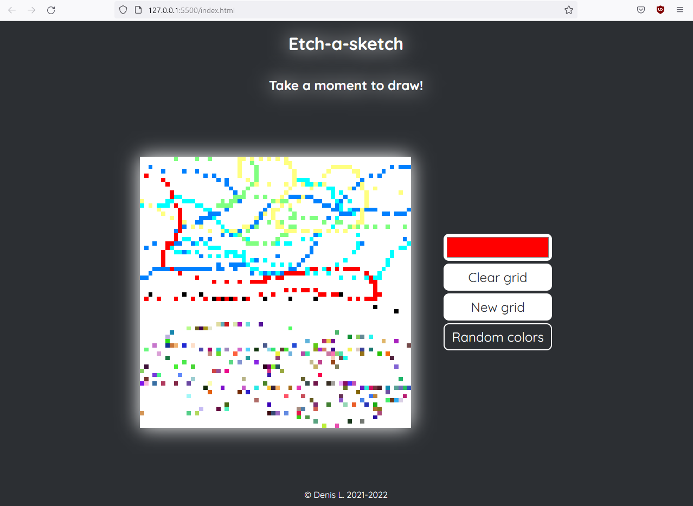

# etch-a-sketch
A Etch-a-sketch app in JS while following The Odin Project.
It has several features including: 
- using a user-defined color
- using a random color for each pixel
- user-set grid size

It isn't responsive yet.
This project's purpose was to practice CSS, notably flexbox and grid, while learning DOM Manipulation using JavaScript.

Live: [Etch a sketch on GitHub Pages](https://bussun.github.io/etch-a-sketch)
## Screenshot:

